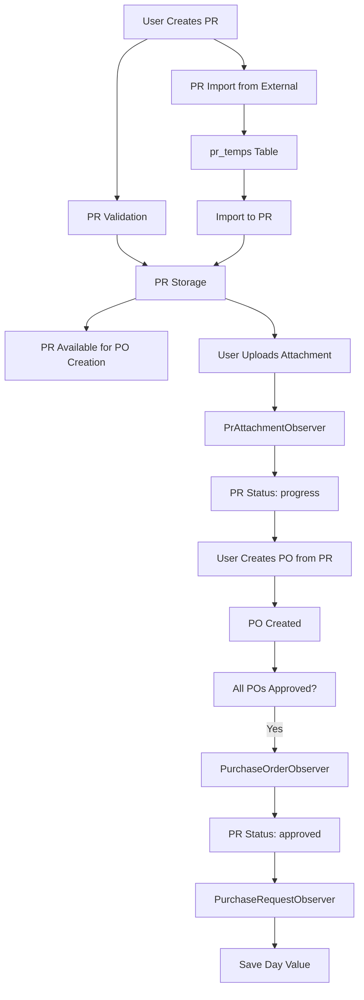
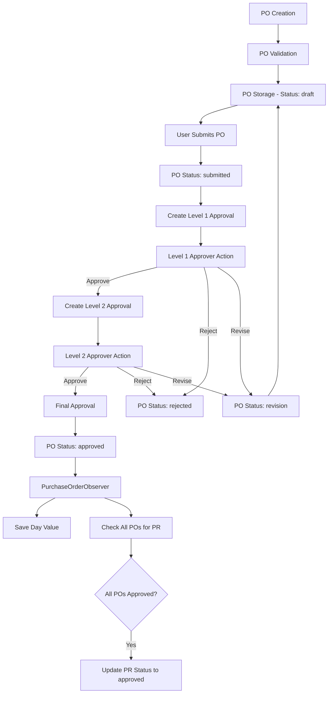
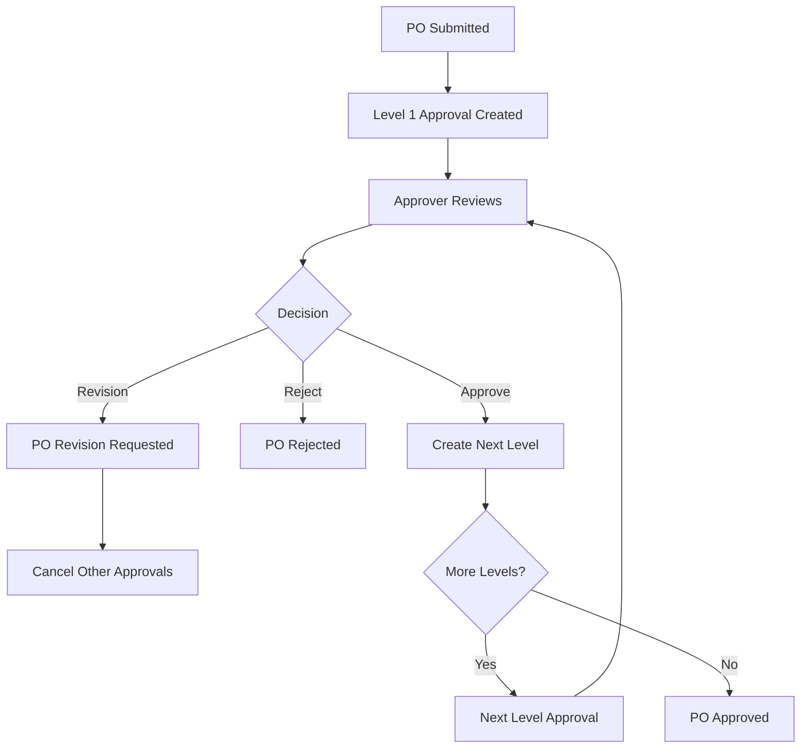
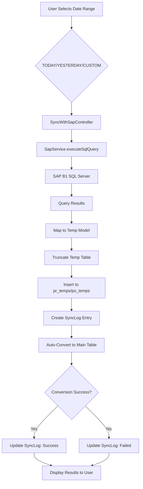
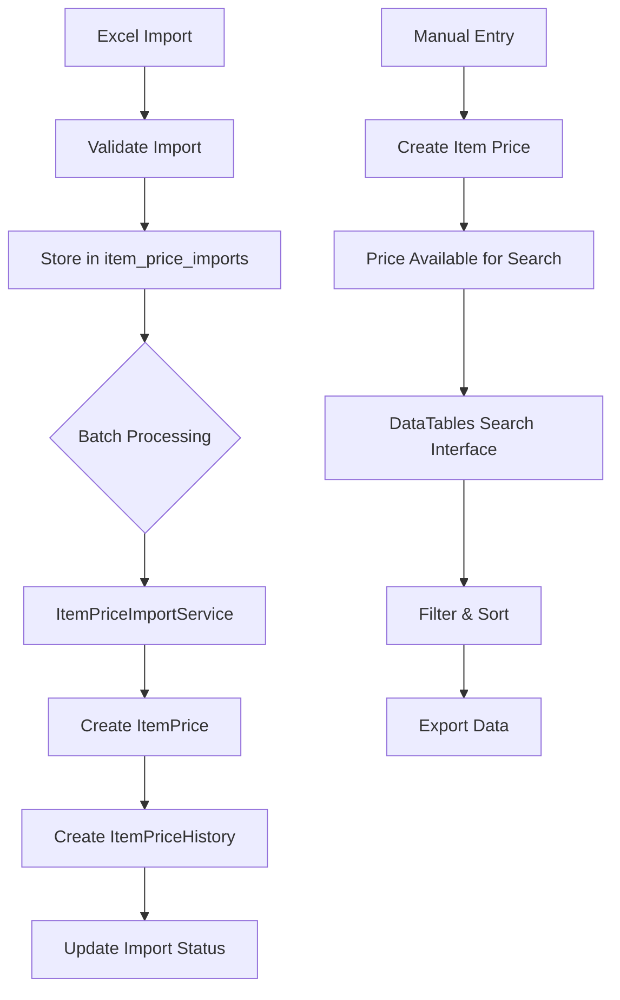
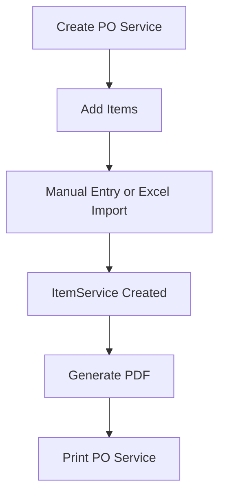

Purpose: Technical reference for understanding system design and development patterns
Last Updated: 2025-11-17

## Architecture Documentation Guidelines

### Document Purpose

This document describes the CURRENT WORKING STATE of the application architecture. It serves as:

-   Technical reference for understanding how the system currently works
-   Onboarding guide for new developers
-   Design pattern documentation for consistent development
-   Schema and data flow documentation reflecting actual implementation

### What TO Include

-   **Current Technology Stack**: Technologies actually in use
-   **Working Components**: Components that are implemented and functional
-   **Actual Database Schema**: Tables, fields, and relationships as they exist
-   **Implemented Data Flows**: How data actually moves through the system
-   **Working API Endpoints**: Routes that are active and functional
-   **Deployment Patterns**: How the system is actually deployed
-   **Security Measures**: Security implementations that are active

### What NOT to Include

-   **Issues or Bugs**: These belong in `MEMORY.md` with technical debt entries
-   **Limitations or Problems**: Document what IS working, not what isn't
-   **Future Plans**: Enhancement ideas belong in `backlog.md`
-   **Deprecated Features**: Remove outdated information rather than marking as deprecated
-   **Wishlist Items**: Planned features that aren't implemented yet

### Update Guidelines

-   **Reflect Reality**: Always document the actual current state, not intended state
-   **Schema Notes**: When database schema has unused fields, note them factually
-   **Cross-Reference**: Link to other docs when appropriate, but don't duplicate content

### For AI Coding Agents

-   **Investigate Before Updating**: Use codebase search to verify current implementation
-   **Move Issues to Memory**: If you discover problems, document them in `MEMORY.md`
-   **Factual Documentation**: Describe what exists, not what should exist

---

# System Architecture

## Project Overview

A comprehensive procurement management system built with Laravel 11, designed to streamline the purchase request and purchase order workflow with multi-level approval processes, including consignment item price tracking and PO Service management.

## Technology Stack

### Backend

-   **Framework**: Laravel 11
-   **PHP Version**: 8.2+
-   **Database**: MySQL (primary), SQL Server (SAP B1 connection via `sap_sql`)
-   **Authentication**: Laravel's built-in authentication (username-based)
-   **Authorization**: Spatie Laravel Permission (role and permission-based)
-   **File Storage**: Laravel Storage (public disk)
-   **Excel Import/Export**: Maatwebsite Excel
-   **PDF Generation**: DomPDF (Barryvdh)

### Frontend

-   **Template**: AdminLTE 3 (Bootstrap 4-based admin template)
-   **JavaScript Libraries**:
    -   jQuery
    -   DataTables (for advanced table features)
    -   SweetAlert2 (for alerts and confirmations)
-   **CSS Framework**: Bootstrap 4

### Development Tools

-   **Package Manager**: Composer (PHP), NPM (JavaScript)
-   **Version Control**: Git

## Application Structure

### Directory Organization

```
app/
├── Console/Commands/          # Artisan commands
│   ├── SaveDayValueForApprovedPRs.php
│   ├── SaveDayValueForApprovedPOs.php
│   ├── UpdatePrStatusForApprovedPOs.php
│   └── UpdatePrStatusForExistingAttachments.php
├── Http/Controllers/
│   ├── Admin/                # User and role management
│   ├── Approvals/            # PO approval workflows
│   ├── Auth/                 # Login and registration
│   ├── Consignment/          # Item price and warehouse management
│   ├── Master/               # Daily PR and PO Temp imports
│   ├── PoService/            # PO Service management
│   └── Procurement/          # PR and PO management
├── Imports/                  # Excel import classes
│   └── ItemPricesImport.php
├── Models/                   # Eloquent models
├── Observers/                # Model observers
│   ├── PrAttachmentObserver.php
│   ├── PurchaseOrderObserver.php
│   └── PurchaseRequestObserver.php
├── Providers/
│   └── AppServiceProvider.php  # Observer registration
└── Services/
    └── ItemPriceImportService.php

routes/
├── admin.php                 # Admin routes
├── approval.php              # Approval routes
├── consignment.php           # Consignment routes
├── master.php                # Master data import routes
├── po_service.php            # PO Service routes
├── procurement.php           # PR and PO routes
├── suppliers.php             # Supplier routes
└── web.php                   # Main routes and auth

resources/views/
├── admin/                    # Admin views
├── approvals/                # Approval views
├── auth/                     # Login/register views
├── consignment/              # Consignment views
├── layout/                   # Shared layouts and partials
├── master/                   # Master import views
├── po_service/               # PO Service views
└── procurement/              # PR and PO views
```

## Core Components

### 1. Authentication & Authorization

#### Authentication

-   Username-based authentication (not email)
-   Session-based authentication
-   Guest middleware for login/register pages
-   Auth middleware for protected routes

#### Authorization

-   Spatie Laravel Permission package
-   Role-based access control (RBAC)
-   Permission-based route protection
-   Middleware aliases: `role`, `permission`, `role_or_permission`
-   Registered in `bootstrap/app.php`

#### Roles

-   **superadmin**: Full system access
-   **admin**: Administrative access
-   **adminproc**: Procurement admin access
-   **director**: Approval authority (level 2)
-   **buyer**: Procurement operations
-   **user**: Basic user access

#### Permissions

-   `akses_admin`: Admin panel access
-   `akses_permission`: Permission management
-   `akses_user`: User management
-   `akses_master`: Master data access
-   `akses_procurement`: Procurement module access
-   `akses_approval`: Approval module access
-   `akses_report`: Reports access
-   `akses_proc_po`: PO management
-   `akses_proc_pr`: PR management
-   `view_poservice`: PO Service access
-   `access_consignment`: Consignment module access
-   `upload_consignment`: Consignment upload access
-   `crud_consignment`: Consignment CRUD operations
-   `search_consignment`: Consignment search access
-   `sync-custom-date`: Access to custom date range selection in SAP sync (v2.2)
-   `impor-sap-data`: Access to PR Import and PO Import menu items (v2.2)

### 2. Purchase Request (PR) Management

#### Features

-   PR creation and tracking
-   PR status monitoring (OPEN, progress, approved, CLOSED)
-   PR search and filtering
-   PR details with line items
-   Attachment management (upload, view, delete)
-   Day calculation (time since generation)
-   Import from temporary tables (pr_temps)

#### Status Workflow

```
OPEN → progress (when attachment added) → approved (when all POs approved)
```

#### Models

-   **PurchaseRequest**: Main PR model
-   **PurchaseRequestDetail**: PR line items
-   **PrAttachment**: PR attachments

#### Controllers

-   `App\Http\Controllers\Procurement\PRController`

#### Observers

-   **PurchaseRequestObserver**: Handles day value saving when status changes to approved
-   **PrAttachmentObserver**: Auto-updates PR status to 'progress' when attachment added

### 3. Purchase Order (PO) Management

#### Features

-   PO creation from scratch or based on PRs
-   PO editing and updating
-   PO details with line items
-   File attachments for POs (upload, view, preview Excel)
-   PO search and advanced filtering
-   Day calculation (time since creation)
-   Import from temporary tables (po_temps)

#### Status Constants

-   `STATUS_DRAFT`: Initial state
-   `STATUS_SUBMITTED`: Submitted for approval
-   `STATUS_APPROVED`: Fully approved
-   `STATUS_REJECTED`: Rejected by approver
-   `STATUS_REVISION`: Revision requested

#### Models

-   **PurchaseOrder**: Main PO model
-   **PurchaseOrderDetail**: PO line items
-   **PoAttachment**: PO attachments

#### Controllers

-   `App\Http\Controllers\Procurement\POController`

#### Observers

-   **PurchaseOrderObserver**: Handles day value saving and PR status updates when PO approved

### 4. Multi-level Approval Workflow

#### Features

-   Configurable approval levels (hierarchical)
-   Sequential approval process
-   Approval, rejection, and revision request actions
-   Approval history tracking
-   Approval notifications

#### Models

-   **ApprovalLevel**: Defines approval hierarchy (level 1, 2, etc.)
-   **Approver**: Maps users to approval levels
-   **PurchaseOrderApproval**: Tracks approval status and history

#### Approval Flow

```
PO Submitted → Level 1 Approval → Level 2 Approval → ... → Final Approval
```

#### Approval Statuses

-   `pending`: Awaiting approval
-   `approved`: Approved at this level
-   `rejected`: Rejected at this level
-   `revision`: Revision requested
-   `cancelled`: Cancelled due to revision request

#### Controllers

-   `App\Http\Controllers\PurchaseOrderApprovalController`
-   `App\Http\Controllers\Approvals\POController`

### 5. Consignment & Item Price Tracking

#### Features

-   Item price management with history tracking
-   Warehouse management
-   Excel import for bulk item price updates
-   Price history visualization
-   Advanced search capabilities with DataTables integration
-   Flexible filtering by item code, description, part number, brand, supplier, warehouse
-   Export functionality (CSV, Excel, PDF, print)

#### Models

-   **ItemPrice**: Current item prices
-   **ItemPriceHistory**: Historical price records
-   **ItemPriceImport**: Temporary data for Excel imports
-   **Warehouse**: Warehouse information

#### Services

-   **ItemPriceImportService**: Processes batch imports with validation

#### Controllers

-   `App\Http\Controllers\Consignment\ItemPriceController`
-   `App\Http\Controllers\Consignment\ImportController`
-   `App\Http\Controllers\Consignment\WarehouseController`
-   `App\Http\Controllers\Consignment\ConsignmentController`

### 6. PO Service Management

#### Features

-   PO Service creation and management
-   Item service management with Excel import
-   PDF generation and printing
-   Service item tracking

#### Models

-   **PoService**: PO Service header
-   **ItemService**: PO Service line items

#### Controllers

-   `App\Http\Controllers\PoService\PoServiceController`
-   `App\Http\Controllers\PoService\ItemServiceController`

### 7. Master Data Management

#### Features

-   Supplier management
-   Department management
-   Project code management
-   Daily PR import from Excel (via pr_temps table)
-   PO Temp import from Excel (via po_temps table)
-   **SAP B1 Direct SQL Server Sync** (v2.2)
    -   Direct synchronization with SAP B1 SQL Server for PR and PO data
    -   Consolidated sync interface for both PR and PO data types
    -   Date range selection (TODAY, YESTERDAY, CUSTOM)
    -   Automatic conversion from temporary tables to main tables after sync
    -   Detailed sync logging and history tracking
    -   Permission-based access control (`sync-custom-date` for custom date ranges, `impor-sap-data` for import menu items)

#### Models

-   **Supplier**: Supplier information
-   **Department**: Department information
-   **Project**: Project data
-   **SyncLog**: Tracks sync operations with status, record counts, and error messages

#### Services

-   **SapService**: Handles SAP B1 SQL Server queries and data mapping
    -   `executePoSqlQuery($startDate, $endDate)`: Executes PO SQL query from `database/list_po.sql`
    -   `executePrSqlQuery($startDate, $endDate)`: Executes PR SQL query from `database/list_pr_generated.sql`
    -   `mapPoResultToModel($row)`: Maps SQL results to PoTemp model
    -   `mapPrResultToModel($row)`: Maps SQL results to PrTemp model

#### Controllers

-   `App\Http\Controllers\Master\DailyPRController`
-   `App\Http\Controllers\Master\POTempController`
-   `App\Http\Controllers\Master\SyncWithSapController`: Consolidated sync controller for PR and PO data

### 8. User Management

#### Features

-   User registration and authentication
-   User activation/deactivation
-   Role assignment to users
-   Permission assignment

#### Controllers

-   `App\Http\Controllers\Admin\UserController`
-   `App\Http\Controllers\Admin\RoleController`
-   `App\Http\Controllers\Auth\LoginController`
-   `App\Http\Controllers\Auth\RegisterController`

## Database Schema

### Core Tables

#### users

-   Primary user accounts
-   Fields: id, name, nik, username (unique), email, password, project, department_id, is_active, timestamps
-   Relationships: hasMany Approvers, belongsTo Department

#### departments

-   Department information
-   Fields: id, department_name, akronim, timestamps

#### projects

-   Project data
-   Fields: id, code, name, timestamps

#### suppliers

-   Supplier information
-   Fields: id, name, code, timestamps

### Procurement Tables

#### purchase_requests

-   PR header information
-   Fields: id, pr_draft_no, pr_no, pr_date, generated_date, day (calculated), priority, pr_status, closed_status, pr_rev_no, pr_type, project_code, dept_name, for_unit, hours_meter, required_date, requestor, remarks, timestamps
-   Status: OPEN, progress, approved, CLOSED
-   Relationships: hasMany PurchaseRequestDetail, belongsToMany PrAttachment

#### purchase_request_details

-   PR line items
-   Fields: id, purchase_request_id, item_code, item_name, quantity, uom, open_qty, line_remarks, purchase_order_detail_id, status, timestamps
-   Relationships: belongsTo PurchaseRequest, belongsTo PurchaseOrderDetail

#### purchase_orders

-   PO header information
-   Fields: id, doc_num (unique), doc_date, create_date, day (calculated), po_delivery_date, supplier_id, po_eta, pr_no, unit_no, po_currency, total_po_price, po_with_vat, project_code, dept_code, po_status, po_delivery_status, budget_type, status, submitted_by, timestamps
-   Status: draft, submitted, approved, rejected, revision
-   Relationships: belongsTo Supplier, hasMany PurchaseOrderDetail, hasMany PurchaseOrderApproval, belongsToMany PoAttachment

#### purchase_order_details

-   PO line items
-   Fields: id, purchase_order_id, item_code, description, remark1, remark2, qty, uom, unit_price, timestamps
-   Relationships: belongsTo PurchaseOrder

#### po_temps

-   Temporary PO data for imports
-   Used for importing PO data from Excel before creating actual POs

#### pr_temps

-   Temporary PR data for imports
-   Used for importing PR data from Excel or SAP B1 sync before creating actual PRs

#### sync_logs

-   Tracks SAP B1 synchronization operations
-   Fields: id, data_type (enum: PR, PO), start_date, end_date, records_synced, records_created, records_skipped, sync_status (enum: success, failed, partial), convert_status (enum: success, failed, skipped), error_message, user_id, timestamps
-   Relationships: belongsTo User
-   Used for audit trail and troubleshooting sync operations

### Approval System Tables

#### approval_levels

-   Defines the hierarchy of approvals
-   Fields: id, name, level, timestamps
-   Relationships: hasMany PurchaseOrderApproval, hasMany Approvers

#### approvers

-   Maps users to approval levels
-   Fields: id, user_id, approval_level_id, timestamps
-   Relationships: belongsTo User, belongsTo ApprovalLevel

#### purchase_order_approvals

-   Tracks approval status and history
-   Fields: id, purchase_order_id, approver_id (nullable), approval_level_id, status (enum: pending, approved, rejected, revision), notes, approved_at, timestamps
-   Relationships: belongsTo PurchaseOrder, belongsTo Approver, belongsTo ApprovalLevel

### Attachment System Tables

#### po_attachments

-   Stores PO attachment metadata
-   Fields: id, original_name, file_path, description, timestamps
-   Relationships: belongsToMany PurchaseOrder

#### po_attachment_purchase_order

-   Pivot table mapping attachments to POs
-   Fields: po_attachment_id, purchase_order_id, timestamps

#### pr_attachments

-   Stores PR attachment metadata
-   Fields: id, original_name, file_path, description, keterangan, pr_no, file_type, file_size, timestamps
-   Relationships: belongsToMany PurchaseRequest

#### pr_attachment_purchase_request

-   Pivot table mapping attachments to PRs
-   Fields: pr_attachment_id, purchase_request_id, timestamps

### Consignment Tables

#### warehouses

-   Warehouse information
-   Fields: id, name, code, description, timestamps

#### item_prices

-   Item price information
-   Fields: id, supplier_id, item_code (nullable, indexed), item_description (nullable, indexed), part_number, brand, project (nullable, indexed), warehouse (nullable, indexed), start_date, expired_date, uploaded_by, uom, qty, price, description, timestamps
-   Relationships: belongsTo Supplier, belongsTo User (uploader), hasMany ItemPriceHistory

#### item_price_histories

-   Historical price records
-   Fields: id, item_code (nullable, indexed), item_description (nullable, indexed), supplier_id, project (nullable), warehouse (nullable), part_number, brand, price, uom, qty, start_date, expired_date, created_by, timestamps
-   Relationships: belongsTo Supplier, belongsTo User (creator)

#### item_price_imports

-   Temporary data for Excel imports
-   Fields: id, supplier_id, item_code, item_description, part_number, brand, project, warehouse, start_date, expired_date, uom, qty, price, description, import_batch, status (pending/processed/error), error_message, uploaded_by, timestamps
-   Relationships: belongsTo Supplier, belongsTo User (uploader)

### PO Service Tables

#### po_services

-   PO Service header
-   Fields: id, po_no (unique), date, vendor_code, project_code, is_vat, remarks, print_count, created_by, updated_by, deleted_by, deleted_at (soft deletes), timestamps
-   Relationships: belongsTo Supplier (via vendor_code), hasMany ItemService

#### item_services

-   PO Service line items
-   Fields: id, po_service_id, item_code, item_desc, qty, uom, unit_price, created_by, updated_by, timestamps
-   Relationships: belongsTo PoService

### Authorization Tables (Spatie Permission)

#### roles

-   User roles
-   Fields: id, name (unique), guard_name, timestamps

#### permissions

-   System permissions
-   Fields: id, name (unique), guard_name, timestamps

#### model_has_roles

-   User-role relationships
-   Fields: role_id, model_type, model_id

#### model_has_permissions

-   Direct user-permission relationships
-   Fields: permission_id, model_type, model_id

#### role_has_permissions

-   Role-permission relationships
-   Fields: permission_id, role_id

## Application Workflow

### Purchase Request (PR) Flow



### Purchase Order (PO) Flow



### Approval Workflow



### SAP B1 Direct Sync Flow (v2.2)



### Consignment Item Price Flow



### PO Service Flow



## Observer Pattern Implementation

### Registered Observers (AppServiceProvider)

1. **PrAttachmentObserver**

    - `created`: Auto-updates PR status to 'progress' when attachment uploaded
    - `deleted`: Reverts PR status to 'OPEN' if no attachments remain

2. **PurchaseOrderObserver**

    - `updating`: Saves day value when status changes to 'approved'
    - `updated`: Checks if all POs for PR are approved and updates PR status

3. **PurchaseRequestObserver**
    - `updating`: Saves day value when status changes to 'approved'

### Observer Registration Location

`app/Providers/AppServiceProvider.php::boot()`

## Route Organization

### Route Files

1. **web.php**: Main routes, authentication, includes other route files
2. **admin.php**: User and role management routes
3. **procurement.php**: PR and PO management routes
4. **approval.php**: Approval workflow routes
5. **master.php**: Master data import routes and SAP B1 sync routes
    -   `/master/sync-with-sap`: Consolidated SAP sync interface
    -   `/master/sync-with-sap/sync-pr`: PR sync endpoint
    -   `/master/sync-with-sap/sync-po`: PO sync endpoint
    -   `/master/dailypr`: PR import from Excel
    -   `/master/potemp`: PO import from Excel
6. **consignment.php**: Consignment module routes
7. **po_service.php**: PO Service routes
8. **suppliers.php**: Supplier management routes

### Route Middleware

-   **Guest routes**: Login, register
-   **Auth routes**: All authenticated routes
-   **Permission-based**: Routes protected by Spatie Permission middleware

## Artisan Commands

### Data Migration Commands

1. **pr:update-status-for-attachments**

    - Updates existing PRs with attachments to 'progress' status
    - Location: `app/Console/Commands/UpdatePrStatusForExistingAttachments.php`

2. **pr:update-status-for-approved-pos**

    - Updates PR status to 'approved' where all related POs are approved
    - Location: `app/Console/Commands/UpdatePrStatusForApprovedPOs.php`

3. **pr:save-day-value-for-approved**

    - Saves day values for existing approved PRs
    - Location: `app/Console/Commands/SaveDayValueForApprovedPRs.php`

4. **po:save-day-value-for-approved**
    - Saves day values for existing approved POs
    - Location: `app/Console/Commands/SaveDayValueForApprovedPOs.php`

## File Storage

### Storage Configuration

-   **Disk**: `public`
-   **Storage Link**: `php artisan storage:link` creates symlink from `storage/app/public` to `public/storage`
-   **Attachment Paths**:
    -   PO Attachments: `storage/app/public/po-attachments/`
    -   PR Attachments: `storage/app/public/pr-attachments/`

### File Handling

-   Attachments stored with original filename
-   File paths stored in attachment tables
-   Excel preview functionality for PO/PR attachments

## Security Implementation

### Authentication

-   Laravel's built-in authentication
-   Session-based with CSRF protection
-   Username-based login (not email)

### Authorization

-   Spatie Laravel Permission for RBAC
-   Middleware protection on routes
-   Permission checks in controllers
-   Role-based menu visibility in views

### Data Protection

-   Input validation on all forms
-   SQL injection prevention via Eloquent ORM
-   XSS protection via Blade templating
-   CSRF tokens on all forms

### File Security

-   File upload validation
-   Storage in protected directory (public/storage)
-   Access control via authentication

## Deployment

### Environment Requirements

-   PHP 8.2+
-   MySQL 5.7+ or 8.0+
-   Composer
-   NPM (for frontend assets if needed)

### Deployment Steps

1.  Environment configuration (`.env`)
2.  Composer install
3.  Database migration (`php artisan migrate`)
4.  Database seeding (`php artisan db:seed`)
5.  Storage link creation (`php artisan storage:link`)
6.  Cache optimization (`php artisan config:cache`, `route:cache`, `view:cache`)
7.  File permissions setup
8.  Data migration commands (if upgrading)

See `DEPLOYMENT_CHECKLIST.md` for detailed deployment procedures.

## Key Design Patterns

### Observer Pattern

-   Model observers for automatic status updates
-   Registered in AppServiceProvider

### Service Pattern

-   ItemPriceImportService for batch processing
-   Separates business logic from controllers

### Repository Pattern (Potential)

-   Some controllers use direct model access
-   Opportunity for repository abstraction if needed

### Factory Pattern

-   Laravel factories for testing data
-   Used in seeders

## Performance Considerations

### Database Indexes

-   Item code indexes on item_prices and item_price_histories
-   Item description indexes
-   Project and warehouse indexes for consignment searches

### Query Optimization

-   Eager loading with `with()` to prevent N+1 queries
-   Pagination for large datasets
-   DataTables client-side processing for consignment search

### Caching

-   Config caching in production
-   Route caching in production
-   View caching in production
-   Permission caching (Spatie Permission)
