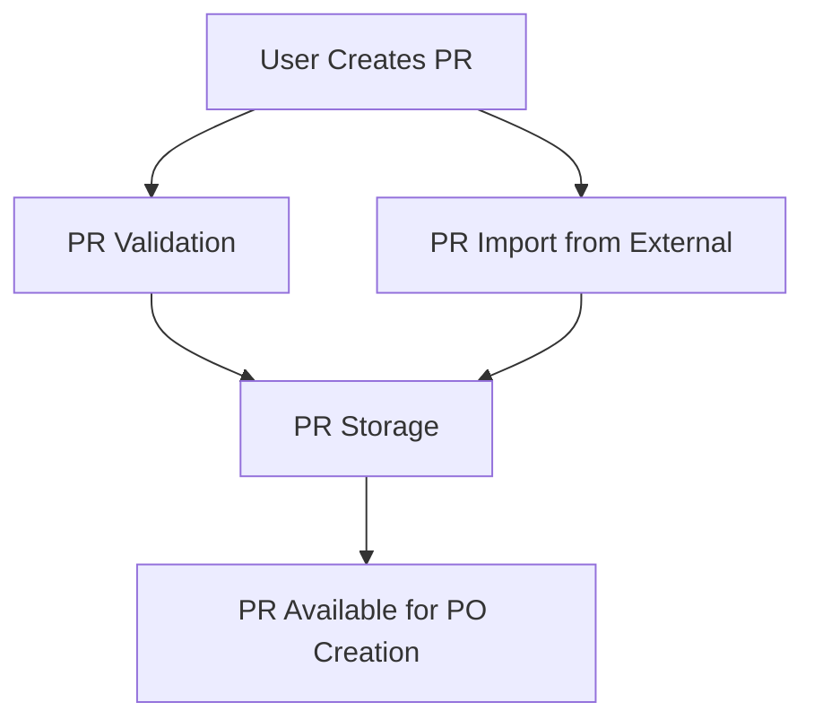
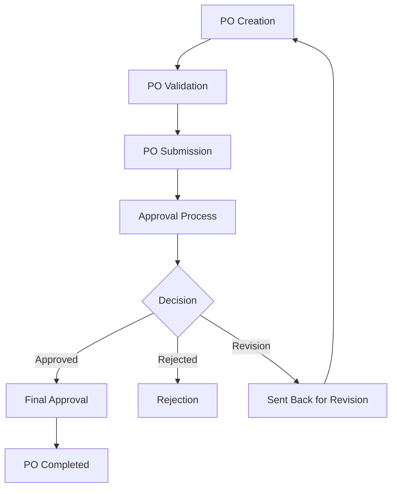
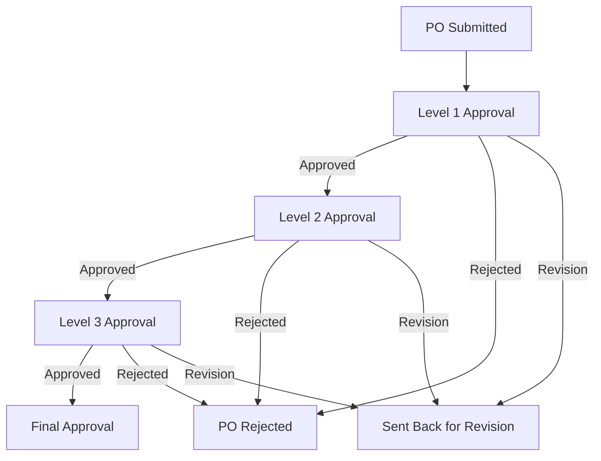

Purpose: Technical reference for understanding system design and development patterns
Last Updated: 2025-07-08

## Architecture Documentation Guidelines

### Document Purpose

This document describes the CURRENT WORKING STATE of the application architecture. It serves as:

-   Technical reference for understanding how the system currently works
-   Onboarding guide for new developers
-   Design pattern documentation for consistent development
-   Schema and data flow documentation reflecting actual implementation

### What TO Include

-   **Current Technology Stack**: Technologies actually in use
-   **Working Components**: Components that are implemented and functional
-   **Actual Database Schema**: Tables, fields, and relationships as they exist
-   **Implemented Data Flows**: How data actually moves through the system
-   **Working API Endpoints**: Routes that are active and functional
-   **Deployment Patterns**: How the system is actually deployed
-   **Security Measures**: Security implementations that are active

### What NOT to Include

-   **Issues or Bugs**: These belong in `MEMORY.md` with technical debt entries
-   **Limitations or Problems**: Document what IS working, not what isn't
-   **Future Plans**: Enhancement ideas belong in `backlog.md`
-   **Deprecated Features**: Remove outdated information rather than marking as deprecated
-   **Wishlist Items**: Planned features that aren't implemented yet

### Update Guidelines

-   **Reflect Reality**: Always document the actual current state, not intended state
-   **Schema Notes**: When database schema has unused fields, note them factually
-   **Cross-Reference**: Link to other docs when appropriate, but don't duplicate content

### For AI Coding Agents

-   **Investigate Before Updating**: Use codebase search to verify current implementation
-   **Move Issues to Memory**: If you discover problems, document them in `MEMORY.md`
-   **Factual Documentation**: Describe what exists, not what should exist

---

# System Architecture

## Project Overview

A comprehensive procurement management system built with Laravel 11, designed to streamline the purchase request and purchase order workflow with multi-level approval processes.

## Technology Stack

-   **Backend Framework**: Laravel 11
-   **PHP Version**: 8.2+
-   **Database**: MySQL
-   **Frontend**:
    -   AdminLTE 3 (Bootstrap 4-based admin template)
    -   jQuery
    -   DataTables
    -   SweetAlert2
-   **Authentication**: Laravel's built-in authentication
-   **Authorization**: Spatie Laravel Permission
-   **File Storage**: Laravel Storage (public disk)
-   **Excel Import/Export**: Maatwebsite Excel

## Core Components

### 1. User Management

-   Role-based access control using Spatie Laravel Permission
-   User registration and authentication
-   User activation/deactivation
-   Role assignment to users

### 2. Role & Permission System

-   Predefined roles: superadmin, admin, adminproc, director, buyer, user
-   Granular permissions for different system areas
-   Permission management interface

### 3. Purchase Request (PR) Management

-   PR creation and tracking
-   PR status monitoring
-   PR search and filtering
-   Import PRs from external data sources

### 4. Purchase Order (PO) Management

-   PO creation from scratch or based on PRs
-   PO editing and updating
-   PO details with line items
-   File attachments for POs
-   PO search and advanced filtering

### 5. Multi-level Approval Workflow

-   Configurable approval levels
-   Sequential approval process
-   Approval, rejection, and revision request actions
-   Approval history tracking
-   Approval notifications

### 6. Master Data Management

-   Supplier management
-   Department management
-   Project code management
-   Item/service catalog

### 7. Import/Export Functionality

-   Import PRs from temporary tables
-   Import POs from temporary tables
-   Bulk data processing

## Database Schema

The database is organized into several key areas:

### Core Tables

-   `users` - User accounts and authentication
-   `departments` - Department information
-   `projects` - Project data
-   `suppliers` - Supplier information

### Procurement Tables

-   `purchase_requests` - PR header information
-   `purchase_request_details` - PR line items
-   `purchase_orders` - PO header information
-   `purchase_order_details` - PO line items
-   `po_temps` - Temporary PO data for imports
-   `pr_temps` - Temporary PR data for imports

### Approval System

-   `approval_levels` - Defines the hierarchy of approvals
-   `approvers` - Maps users to approval levels
-   `purchase_order_approvals` - Tracks approval status and history

### Attachment System

-   `po_attachments` - Stores PO attachment metadata
-   `po_attachment_purchase_order` - Maps attachments to POs
-   `pr_attachments` - Stores PR attachment metadata
-   `pr_attachment_purchase_request` - Maps attachments to PRs

### Authorization Tables

-   `roles` - User roles
-   `permissions` - System permissions
-   `model_has_roles` - User-role relationships
-   `model_has_permissions` - Direct user-permission relationships
-   `role_has_permissions` - Role-permission relationships

## Application Workflow

### Purchase Request (PR) Flow

### Purchase Order (PO) Flow

### Approval Workflow

## Security Implementation

-   Role-based access control
-   Authentication for all procurement actions
-   Authorization checks for approval actions
-   Input validation and sanitization
-   CSRF protection
-   Secure file handling

## Deployment

-   Standard Laravel deployment
-   PHP 8.2+ environment
-   MySQL database
-   File storage configuration for attachments
-   Web server with appropriate PHP configuration
